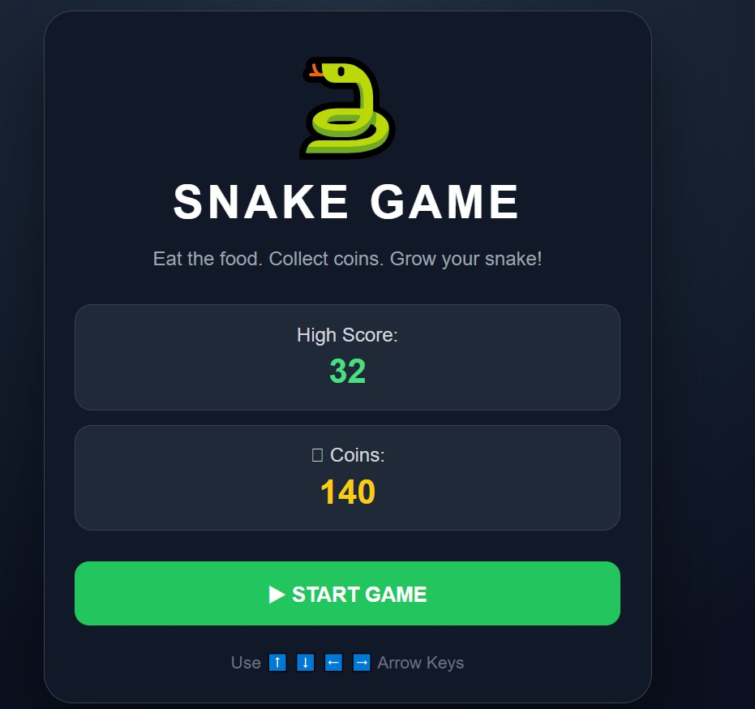
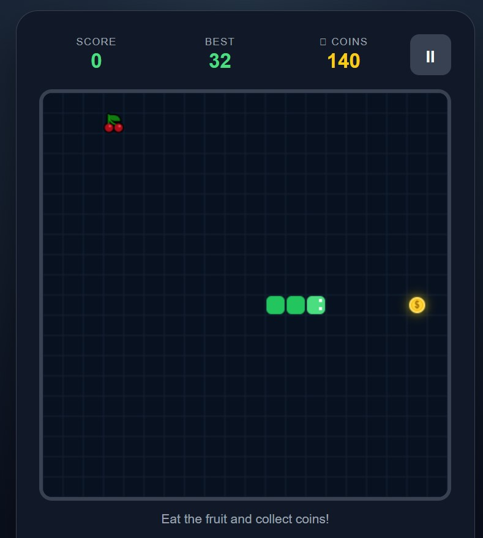
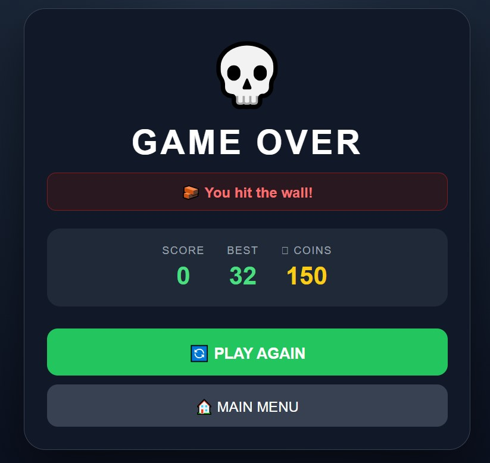

# 🐍 Snake Game

A modern, interactive and responsive Snake Game built with **HTML, CSS and JavaScript** using the HTML5 Canvas API.

🎮 **Play the Game:**  
https://nilyma0n.github.io/snake-game/

---

## 🎮 Game Preview

> A classic Snake Game with a modern interface, multiple fruits, coins, increasing difficulty and responsive controls.

### 🏠 Start Screen



### 🎮 Gameplay



### 💀 Game Over



## ✨ Features

- 🐍 Classic Snake gameplay
- 🍎 Multiple types of fruits
- ⭐ Different fruits give different scores
- 🪙 Collectible gold coins
- 💰 Coins are saved using `localStorage`
- 🏆 Persistent high score
- ⚡ Gradually increasing game speed
- 🎯 Multiple food items as the score increases
- 💀 Professional Game Over screen
- 🧱 Wall collision detection
- 🐍 Self-collision detection
- ⏸️ Pause and Resume functionality
- 🔄 Play Again option
- 🏠 Main Menu
- 📱 Mobile-friendly controls
- 🎨 Modern dark gaming interface
- 🖥️ HTML5 Canvas-based gameplay

---

## 🎯 How to Play

### Desktop

Use the keyboard arrow keys:

| Key | Action |
|---|---|
| ⬆️ Up | Move Up |
| ⬇️ Down | Move Down |
| ⬅️ Left | Move Left |
| ➡️ Right | Move Right |
| ⏸️ Space | Pause / Resume |

### Mobile

Use the on-screen directional buttons to control the snake.

---

## 🍎 Food System

Different fruits provide different scores.

| Fruit | Points |
|---|---:|
| 🍎 Apple | +1 |
| 🍊 Orange | +2 |
| 🍇 Grapes | +3 |
| 🍒 Cherry | +2 |
| 🍓 Strawberry | +2 |

As your score increases, more food can appear on the board.

---

## 🪙 Coin System

A golden coin appears on the game board.

Collecting a coin gives:

**🪙 +10 Coins**

Your total coins are stored in the browser using `localStorage`, so your collected coins remain available even after refreshing the page.

---

## ⚡ Difficulty System

The game starts at a slower speed to make the beginning easier.

As your score increases, the snake gradually becomes faster.

This creates an increasing difficulty curve:

```text
Start
  ↓
Slow Snake
  ↓
Score Increases
  ↓
Snake Gets Faster
  ↓
Higher Difficulty
  ↓
Game Over
